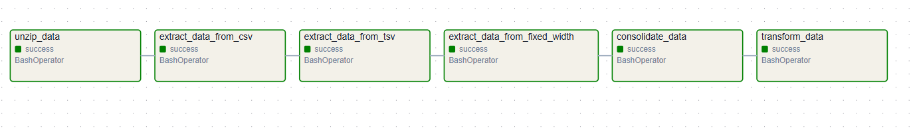

# Toll Data ETL with Shell Scripting and Apache Airflow

This repository demonstrates an ETL (Extract, Transform, Load) pipeline built using Apache Airflow and shell scripting to process toll data from various file formats. The pipeline extracts data from multiple sources, consolidates it into a single structured file, and transforms the data for uniformity. This project highlights how to orchestrate and automate data workflows with Airflow and the power of shell commands for data processing.

## Table of Contents
1. [Project Overview](#project-overview)
2. [Key Features](#key-features)
3. [Pipeline Workflows](#pipeline-workflows)
4. [DAG Graph](#DAG-graphs)
5. [Requirements](#requirements)

## Project Overview

Objective:  

To automate the process of extracting toll data from various file formats (CSV, TSV, fixed-width text), consolidating it into a single CSV file, and applying necessary transformations using shell scripting for ETL tasks and Apache Airflow for orchestration.

Why This Project?
- Demonstrates practical ETL principles in handling diverse data sources.
- Highlights the use of shell scripting for efficient data processing.
- Utilizes Apache Airflow to orchestrate workflows and ensure automation.
- Provides a scalable and reusable solution for consolidating data.

## Key Features
1. **Automated Workflow**  
   - Orchestrates the ETL process using Apache Airflow.

2. **Shell Scripting for ETL Tasks**  
   - Extracts data from various file formats using Unix commands like `cut`, `paste`, and `tr`.  
   - Automates transformation and consolidation without additional libraries.

3. **Multi-Format File Handling**  
   - **CSV**: Extracts specific columns.  
   - **TSV**: Converts tab-separated data into a comma-separated format.  
   - **Fixed-Width**: Processes specific character ranges from fixed-width files.

4. **Data Transformation**  
   - Combines extracted data into a single CSV file.  
   - Converts all text to uppercase for consistency.

5. **Error Handling and Retry Mechanisms**  
   - Ensures reliable execution even if tasks fail.

6. **Scalable Design**  
   - Easily extendable to include new data sources or transformation steps.

## Pipeline Workflows

The pipeline performs the following tasks:

1. **Unzip Data**: Extracts .tgz compressed files into a working directory using tar.  

2. **Extract Data: Processes data from three different sources using shell commands:**
   - CSV: Extracts specific columns using cut.
   - TSV: Converts tab-separated data into comma-separated format with cut and tr.
   - Fixed-Width: Extracts specific character ranges using cut and formats them with tr.  
   
3. **Consolidate Data**: Combines all extracted data into a single CSV file using paste.  

4. **Transform Data**: Converts all text to uppercase using the tr command.

## DAG Graph

## Requirements

- **Apache Airflow** 2.10.2
- **Python** 3.10.11
- **Python libraries**:
  - `airflow`
- **Unix Shell Commands**:
  - `tar, cut, paste, tr`
 
